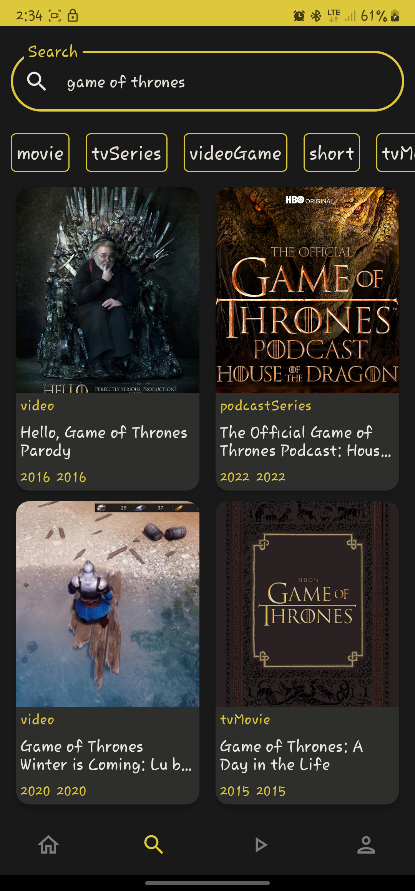
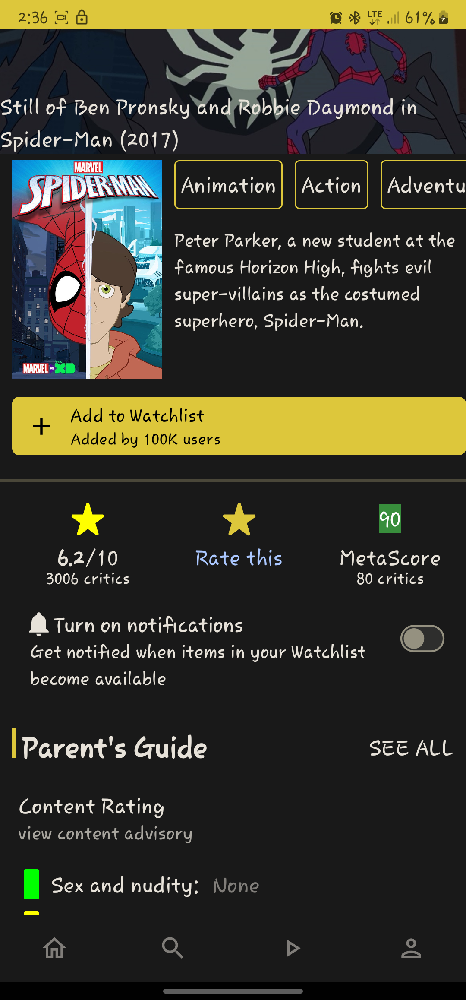
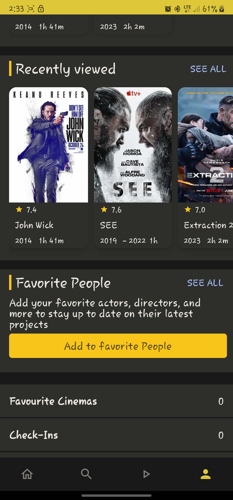
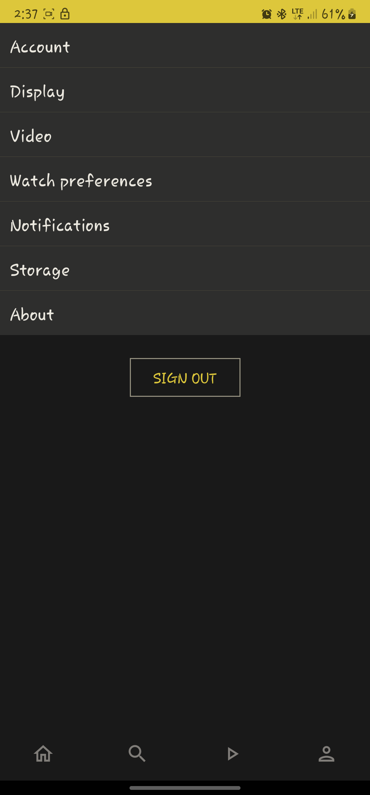
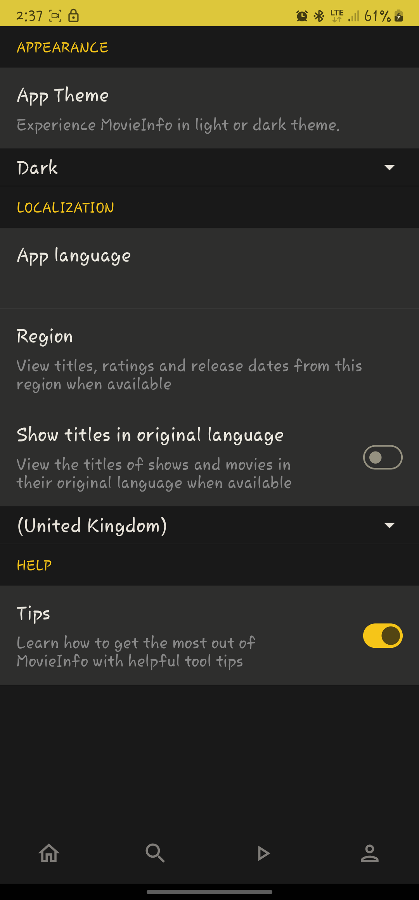

# MovieSearch
MovieInfo is a sample Android app that demonstrates how to call a RESTful server and present the paginated response. It is not a one-to-one clone of the IMDb Android app, but it is heavily inspired by it. The backend relies on a mocked IMDb API from [RapidApi](https://rapidapi.com/apidojo/api/imdb8/).
This app is for educational purposes in native Android development and associated technologies. As such, it is not intended for release or extended maintenance.

## Table of contents
1. [Demo](#demo)
2. [Screenshots](#screenshots)
3. [Tech Stack](#tech-stack)
4. [Features](#features)
5. [Development Setup](#development-setup)
6. [License](#license)

## Demo
https://github.com/keeghan/MovieSearch/assets/40280581/fe1752c6-e87e-43be-9597-795728cea100

## Screenshots
 &nbsp;  &nbsp;  &gt;  &nbsp; 

## Tech Stack
- [Kotlin](https://kotlinlang.org/) as sole Language.
- [Hilt](https://www.google.com/url?client=internal-element-cse&cx=000521750095050289010:zpcpi1ea4s8&q=https://developer.android.com/training/dependency-injection/hilt-android&sa=U&ved=2ahUKEwiW5omeu6z4AhWRR2wGHVUsCo0QFnoECAMQAQ&usg=AOvVaw3dCbP79C6od3KVCnJub3v0) for dependency injection.
- [Jetpack Compose](https://developer.android.com/jetpack/compose) for UI and navigation.
- [Kotlin Coroutines](https://kotlinlang.org/docs/reference/coroutines/coroutines-guide.html) for threading.
- [Coil compose](https://coil-kt.github.io/coil/compose/) for loading images and caching.
- [Retrofit](https://square.github.io/retrofit/) for communicating with the backend API.
- [Paging 3](https://developer.android.com/topic/libraries/architecture/paging/v3-overview) for pagination.
- [Kotlin Flows](https://developer.android.com/kotlin/flow) for creating reactive streams.

<!-- ## Features -->

## Development Setup
Make sure you have downloaded and setup the Android Studio SDK correctly before you begin on this project. Here is the Android Studio documentation to guide you through it: [Android Studio Setup](http://developer.android.com/sdk/installing/index.html?pkg=studio)

## License

This project is currently licensed under the Creative Commons Legal Code : CC0 1.0 Universal